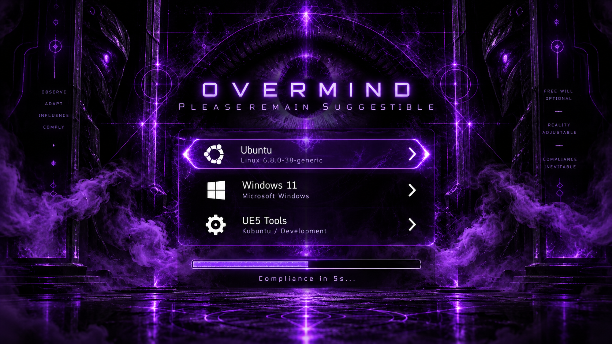
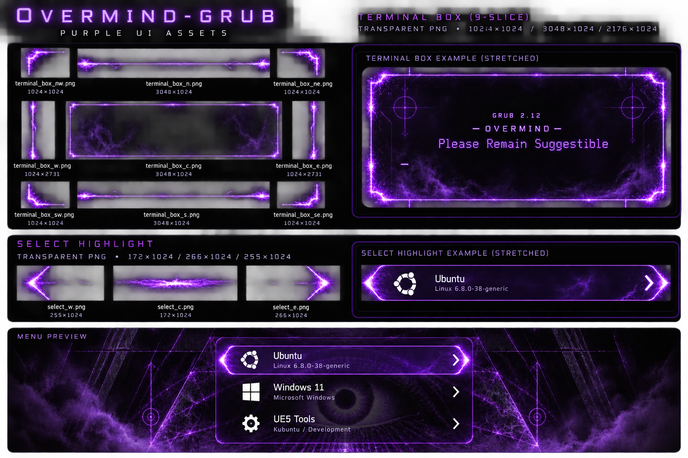

# Overmind-GRUB

> **PLEASE REMAIN SUGGESTIBLE.**



A dark, violet GRUB2 theme built around machine authority, cognitive compliance, surveillance, and the comforting certainty that the system has already made the correct decision for you.

Overmind-GRUB turns the bootloader into a small piece of dystopian theatre: an all-seeing synthetic intelligence, a congregation of compliant subjects, glowing violet control channels, and a terminal that looks considerably more interested in you than a bootloader has any right to be.

---

## DIRECTIVE 01 — SUBMIT TO THE OVERMIND

The visual language of Overmind-GRUB is deliberately oppressive:

- black and ultraviolet-violet palette
- all-seeing AI / surveillance imagery
- luminous neural-control motifs
- synthetic authority rather than occult mysticism
- translucent violet terminal frame
- violet menu selection graphics
- custom GRUB fonts and icon support
- themed countdown and boot messaging
- multiple pre-rendered background resolutions

The active theme text is designed around the same fiction:

```text
Please Remain Suggestible
```

and the countdown may remind you that:

```text
Compliance in %ds...
```

This is normal.
Do not investigate further.

---

## DIRECTIVE 02 — VISUAL ASSETS

Overmind-GRUB includes backgrounds prepared for common GRUB resolutions:

```text
640x480
800x600
1024x768
1280x720
1280x800
1280x1024
1366x768
1440x900
1600x900
1680x1050
1920x1080
2560x1440
3840x2160
```

The default configuration targets:

```text
1280x720
```

because it is a low-overhead widescreen mode commonly exposed by UEFI GOP implementations.

Other supplied backgrounds can be enabled by changing `desktop-image` in `theme.txt`.

The repository also contains:

```text
terminal_box_*.png
select_*.png
terminus-18.pf2
soniano-32.pf2
camingo-20.pf2
icons/
```

The terminal uses a nine-slice translucent violet frame, allowing GRUB's console output to remain readable without replacing the entire background with an opaque black rectangle.

---

## THE OVERMIND INTERFACE



Overmind-GRUB is more than a background swap. The theme is built as a complete GRUB visual layer so the menu, selection state, countdown, and console handoff all belong to the same fiction.

The interface is deliberately split into three visual systems:

- **The observation layer** — the background artwork, all-seeing AI imagery, synthetic overseers, violet circuitry, and surveillance motifs.
- **The compliance layer** — the boot menu, selection frame, title text, and countdown. These elements stay readable while preserving the illusion that the machine is evaluating the subject rather than simply offering a list of operating systems.
- **The terminal layer** — the nine-slice `terminal_box_*.png` frame and `Terminus Regular 18` console font. This replaces GRUB's abrupt opaque black console slab with a translucent violet-edged panel that keeps the artwork visible during handoff and diagnostic output.

The selected entry is drawn with the three-piece `select_*.png` set, allowing GRUB to stretch the highlight cleanly without distorting its end caps. The terminal uses the same principle with nine independent slices, so corners, edges, and the translucent centre can scale independently across different resolutions.

The supplied background pack is resolution-specific on purpose. GRUB runs through firmware graphics modes rather than the full desktop graphics stack, so the safest result comes from selecting a background that exactly matches a mode reported by `videoinfo`. The default remains `1280x720`, but the theme ships common 4:3, 16:10, 16:9, QHD, and 4K variants for other hardware.

The result should feel consistent from first render to kernel handoff: the subject is observed, a choice is presented, compliance is recorded, and the machine proceeds as though this was always the expected outcome.

> **FREE WILL STATUS: EMULATED**

---

## DIRECTIVE 03 — INSTALLATION

### Ubuntu / Kubuntu / Mint / Debian

1. Copy the repository into GRUB's theme directory:

```bash
sudo mkdir -p /boot/grub/themes
sudo cp -a Overmind-GRUB /boot/grub/themes/overmind
```

2. Edit:

```bash
sudo nano /etc/default/grub
```

3. Set:

```ini
GRUB_THEME="/boot/grub/themes/overmind/theme.txt"
```

For systems known to support 1280x720 in GRUB:

```ini
GRUB_GFXMODE=1280x720
GRUB_GFXPAYLOAD_LINUX=keep
```

4. Regenerate the GRUB configuration:

```bash
sudo update-grub
```

5. Reboot.

6. **Remain suggestible.**

### Arch Linux

Copy the theme into your GRUB themes directory and set:

```ini
GRUB_THEME="/boot/grub/themes/overmind/theme.txt"
```

Then regenerate GRUB, commonly with:

```bash
sudo grub-mkconfig -o /boot/grub/grub.cfg
```

Reboot when instructed by your local machine authority.

---

## DIRECTIVE 04 — CHOOSE AN APPROVED DISPLAY MODE

Do not assume your firmware exposes every resolution your monitor supports.

At the GRUB menu, press `c` and run:

```text
videoinfo
```

Use one of the modes GRUB reports.

A 4K monitor may still expose only a limited set of GOP modes at boot. Overmind-GRUB therefore ships both low-resolution and high-resolution background variants.

To switch backgrounds, edit `theme.txt`, for example:

```text
desktop-image: "overmind-grub-1280x720.png"
```

Alternative examples can remain commented nearby for easy selection.

---

## DIRECTIVE 05 — IDENTIFICATION OF SUBJECTS

GRUB menu entries can use `--class` values to select icons from the `icons/` directory.

For example, a menu entry with:

```text
--class windows
```

can use:

```text
icons/windows.png
```

depending on the GRUB configuration that generates the entry.

Menu labels may also be simplified. For example:

```text
Windows Boot Manager (on /dev/nvme0n1p1)
```

may be presented as:

```text
Windows 11
```

This is purely cosmetic.

The Overmind already knows which disk you meant.

---

## DIRECTIVE 06 — TERMINAL COMPLIANCE LAYER

The console is styled using:

```text
terminal-box: "terminal_box_*.png"
```

with the nine-slice assets:

```text
terminal_box_c.png
terminal_box_n.png
terminal_box_s.png
terminal_box_e.png
terminal_box_w.png
terminal_box_ne.png
terminal_box_nw.png
terminal_box_se.png
terminal_box_sw.png
```

This creates a translucent dark terminal with a violet perimeter instead of GRUB's default opaque black console block.

The terminal font is:

```text
Terminus Regular 18
```

Readable.
Efficient.
Emotionally neutral.

As intended.

---

## DIRECTIVE 07 — SELECTION AND COMPLIANCE FEEDBACK

The selected menu item uses:

```text
selected_item_pixmap_style = "select_*.png"
```

with:

```text
select_c.png
select_e.png
select_w.png
```

These assets form the violet selection bar around the currently approved boot choice.

You may select another operating system.

The Overmind permits the illusion of agency.

---

## DIRECTIVE 08 — MODIFICATION

Overmind-GRUB is intended to be modified.

Useful places to begin:

- replace or add `overmind-grub-<resolution>.png` backgrounds
- alter violet shades in `theme.txt`
- replace `select_*.png`
- modify the terminal nine-slice set
- add GRUB class icons
- change the title and timeout phrases
- adjust menu position for artwork composition

Recommended thematic strings include:

```text
Please Remain Suggestible
Cognitive Override Ready
Awaiting Compliance
Directive Accepted
Thought Process Normalised
Independent Boot Selection Detected
```

Use responsibly.

Or at least aesthetically.

---

## SYSTEM STATUS

```text
OVERMIND ................. ONLINE
SUBJECT .................. DETECTED
COGNITIVE RESISTANCE ..... NOMINAL
BOOT OPTIONS ............. PRESENTED
FREE WILL ................. EMULATED
COMPLIANCE ................ PENDING
```

If you can read this, the interface is functioning normally.

---

## CREDITS / LINEAGE

Overmind-GRUB is maintained by **Sleeping Ninja** and evolved from the work of several GRUB theme projects.

Project lineage:

1. **Overmind-GRUB** — Sleeping Ninja  
   https://github.com/sleeping-ninja/Overmind-GRUB

2. **Umbralite GRUB Theme** — lawsonlam07  
   https://github.com/lawsonlam07/Umbralite-Grub-Theme

3. **Xenlism GRUB Themes** — Xenlism  
   https://github.com/xenlism/Grub-themes

4. **Vinceliuice GRUB2 Themes** — Vinceliuice  
   https://github.com/vinceliuice/grub2-themes

The inherited theme structure, font usage, icon conventions, menu styling concepts, and GRUB theme mechanics owe their existence to that upstream work.

Fonts inherited from the upstream theme include:

- **Soniano Sans** — menu options
- **Camingo Code** — progress / countdown elements
- **Terminus** — terminal

See the repository `LICENSE` and upstream projects for applicable licensing information.

---

## FINAL DIRECTIVE

The machine is ready.

The bootloader is watching.

**Please Remain Suggestible.**
